# Project 3 - Design & Plan

Your Name: Yuzhe Sheng

## 1. Persona

I've selected **Abby** as my persona because my website will have a clear and obstacle-free navigation process that Abby will experience no trouble navigating through. In addition, my website displays all images and tags at once, which conforms to Abby's habit that she gathers information comprehensively before she learns more about the website in detail.

## 2. Sketches & Wireframes

### Sketches

#### 1. The main page
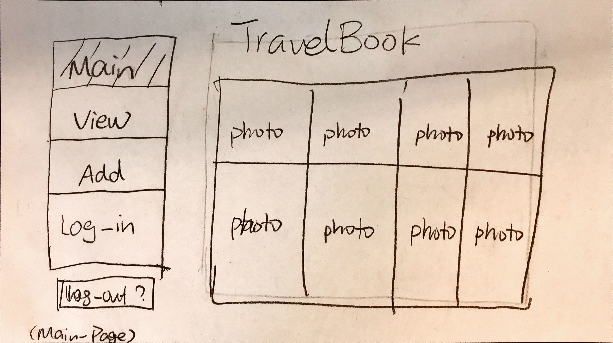

#### 2. The log-in page
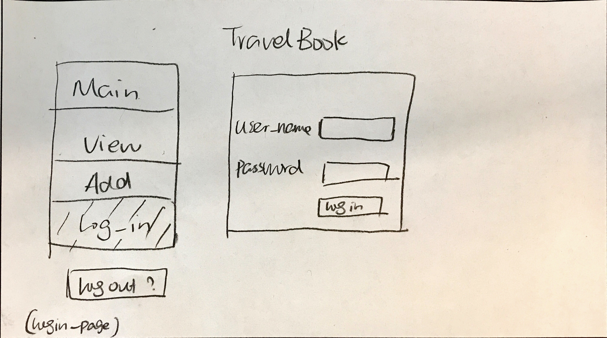

#### 3. The Add image page
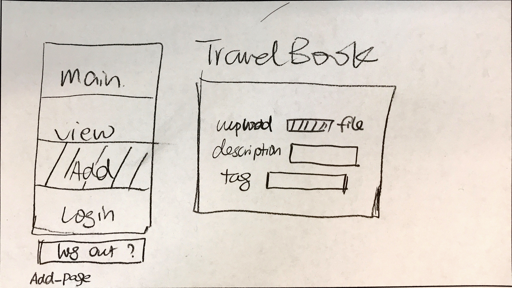

### Wirefames

#### 1. The main page
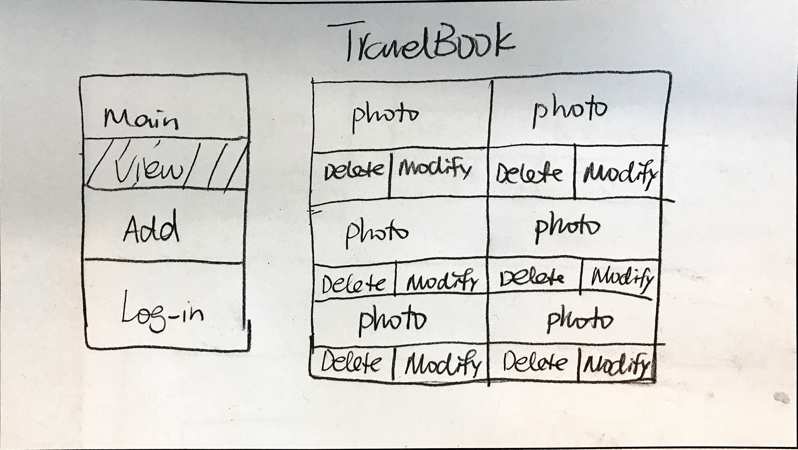

#### 2. The log-in page
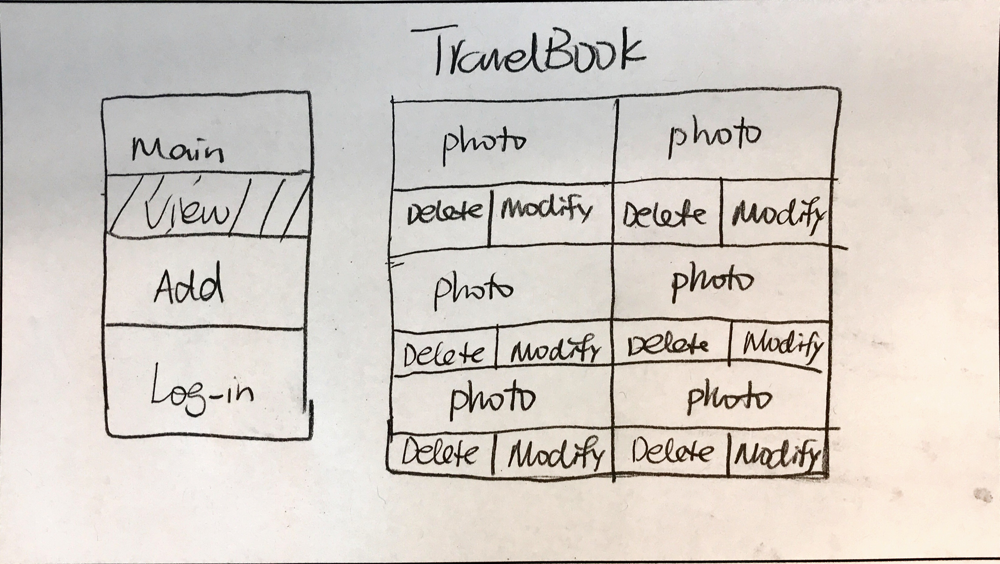

#### 3. The Add image page
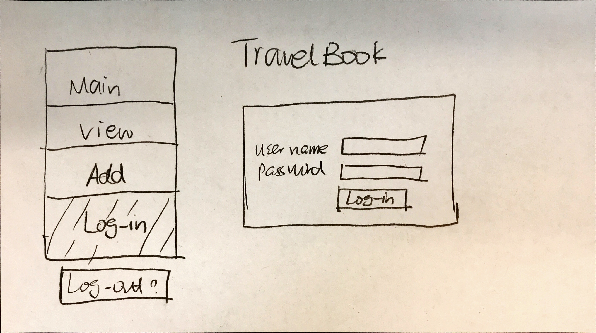

This is suitable for Abby since the navigation bar is clear presented in each page. Also, the home page contains a comprehensive knowledge of all the images of the gallery.
### New wireframes
The design has been upldate. See the following for new wireframes.
#### 1. The main page
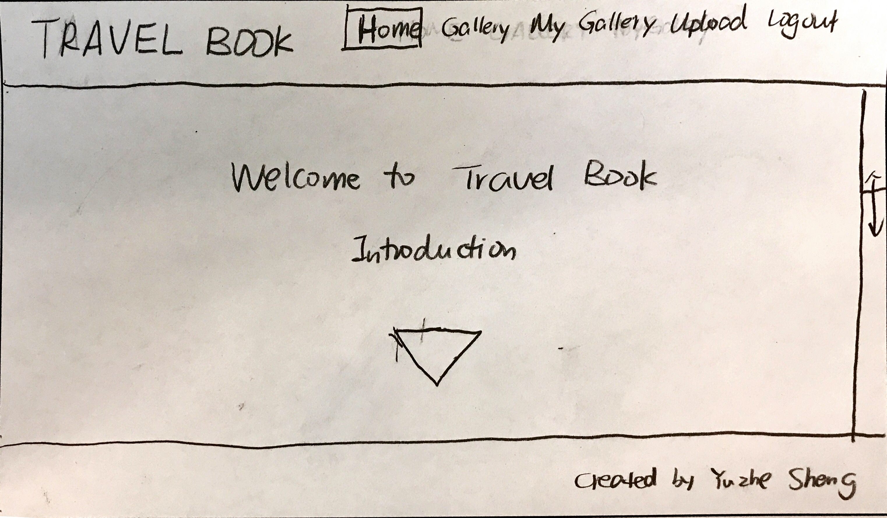

#### 2. The gallery
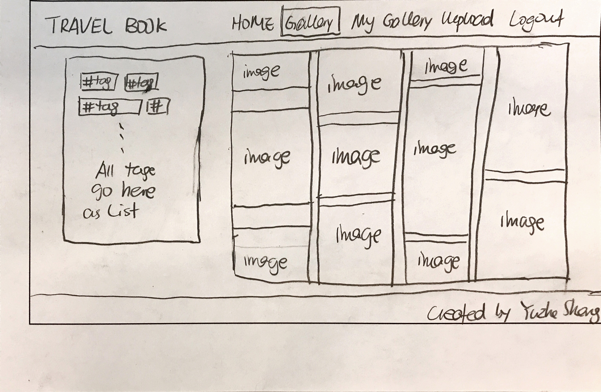

#### 3. The log in page, which shares the same page with the My Gallery page
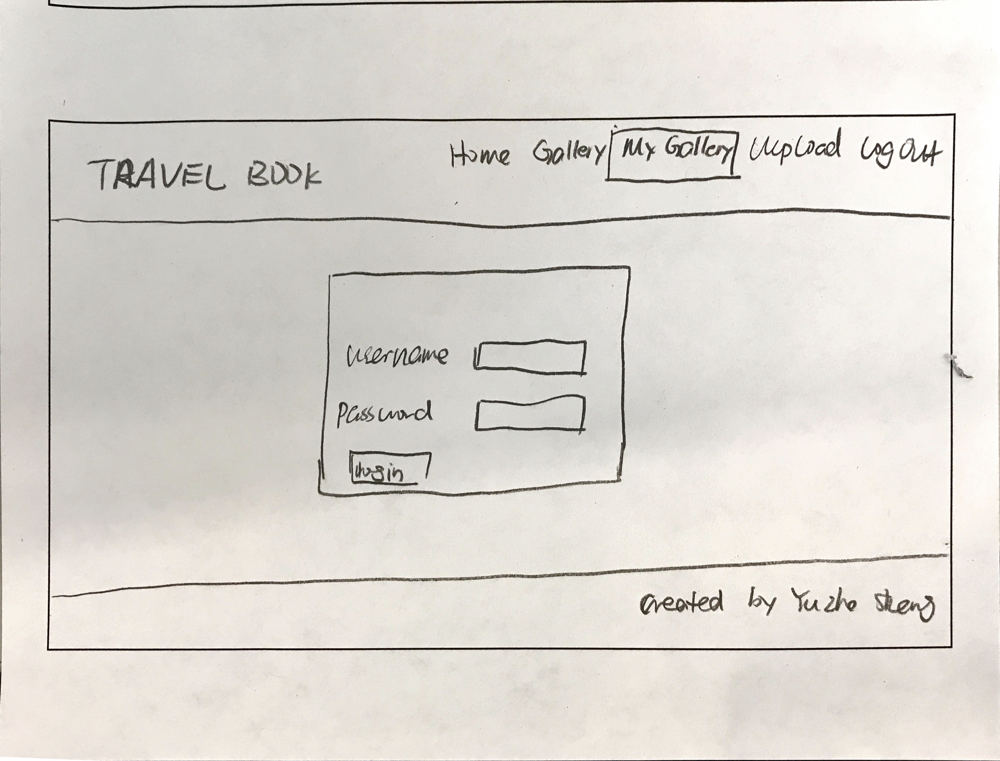

#### 4. My gallery page, which shows the image after the user has logged in
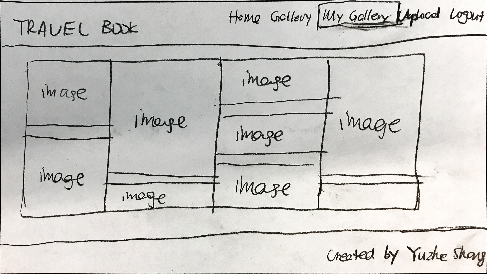
#### 5. Upload
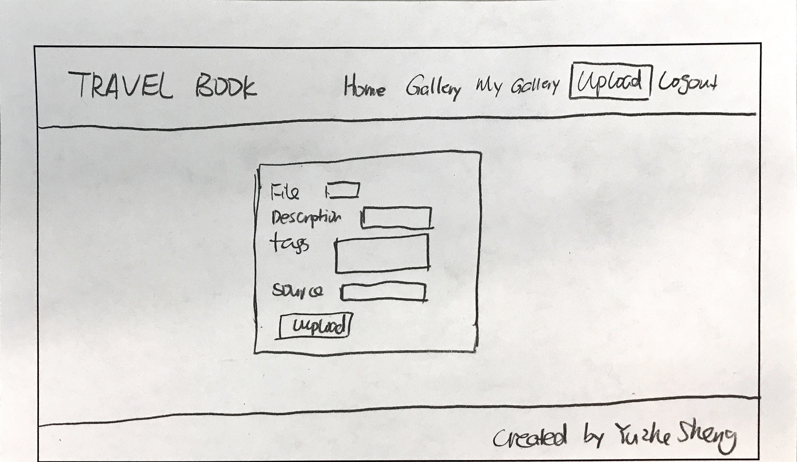

The new design was adopted because it is low-key and neater than the previous design. The new design looks cleaner so Abby would experience no trouble navigating through them. Also, the new design incorporates some animations, which will be suitable for Abby since the animations provide a way to direct the user how to proceed and navigate through the websites.
## 3. Database Schema Plan

[Describe the structure of your database. You may use words or a picture. A bulleted list is probably the simplest way to do this.]

Table: images
* field 1: image_id (INTEGER, PRIMARY KEY, NOT NULL, AUTOINCREMENT, UNIQUE)
* field 2: image_name (TEXT, NOT NULL)
* field 3: image_ext (TEXT, NOT NULL)
* field 3: description (TEXT)
* field 4: user_id(INTEGER, NOT NULL)
* field 5: citation (TEXT)

Table: tags
* field 1: tag_id(INTEGER, PRIMARY KEY, NOT NULL, AUTOINCREMENT, UNIQUE)
* field 2: tag_name (TEXT, NOT NULL)

Table: image_tag
* field 1: image_id(INTEGER, NOT NULL)
* field 2: tag_id(INTEGER, NOT NULL)

Table: accounts
* field 1: user_id(INTEGER, PRIMARY KEY, NOT NULL, AUTOINCREMENT, UNIQUE)
* field 2: username(TEXT, NOT NULL, UNIQUE)
* field 3: password(TEXT, NOT NULL)
* field 4: session(TEXT)
* field 5: realname(TEXT, NOT NULL)

## 4. Database Query Plan

### 1. Insert new image with a existing tags
``` SQL
INSERT INTO images (image_name, description, user_id)
VALUES (name, description, user_id);

INSERT INTO image_tag (image_id, tag_id)
VALUES (image_id, tag_id);

```

### 2. Find all photo information for a given tag_id
```SQL
SELECT DISTINCT images.image_id, images.description, images.user_id
FROM images JOIN image_tag
WHERE images.image_id = image_tag.image_id
AND image_tag.tag_id = give_tag_id;
```

### 3. Find all tag information for a given photo_id
```SQL
SELECT DISTINCT tags.tag_id, tags.tag_name
FROM images JOIN image_tag
WHERE images.image_id = image_tag.image_id
AND image_tag.image_id = give_photo_id;
```

### 4. Update tags for an existing give_photo_id
```SQL
UPDATE image_tag
SET image_tag.tag_id = new_tag_id
WHERE image_tag.image_id = give_photo_id;
```

### 5. UPDATE session for a given user_id
```SQL
UPDATE accounts
SET session = session_id
WHERE user_id = id;
```

### 6. Remove a photo with a given id from the Database
```SQL
DELETE *
FROM images
WHERE images.image_id = id;

DELETE *
FROM image_tag
WHERE image_tag.image_id = id;
```
## 5. Structure and Pseudocode

### Structure
* index.php - main page.
* includes/init.php - stuff that useful for every web page.
* private_gallery.php - page for user to log in and view his/her own images only.
* gallery.php - page for users to log in and/or view his/her own images.
* upload.php - page for user to upload images.
* logout.php - page for user to log out.
* single_img.php - page for user to view one image ONLY.

### Pseudocode

[For each PHP file, plan out your pseudocode. You probably want a subheading for each file.]

#### index.php

```
include init.php

```

#### includes/init.php

```
messages = array to store messages for user (you may remove this)

// DB helper functions (you do not need to write this out since they are provided.)

db = connect to db

create navigation bar for each

// Check logged in users
$account = query accounts for logged in user;
if ($account){
  echo "Welcome" + username;
}

// Display images
$results = execute query to fetch required images together with tags;
if ($results) {
  foreach($records) {
    display image with image_id;
    add "delete" and "modify tag" button below each image if the user logged in happens to be the uploader. 
  }
}
```

#### login.php
```
$accounts = HTML form input;
filter $accounts;
check if $username is in the database;
if so, check $password
if so, successfully logged in and set cookies.
else, echo "Failed to log in";
```

### gallery.php
```
include init.php;
create sql query based on the input;
fetchRecords;
print all images;
if a tag is chosen,
query the database to retrieve all images corresponding to that image
display all related information.
```

### upload.php
```
include init.php;
HTML file input;
filter input and file;
create sql for insertion;
Move the file to a desired location.
```
## 6. Seed Data - Username & Passwords

* ronald94@yahoo.com: abcd1234
* ys766: I_love_Traveling
* YuzheSheng: happycodingMonkey
